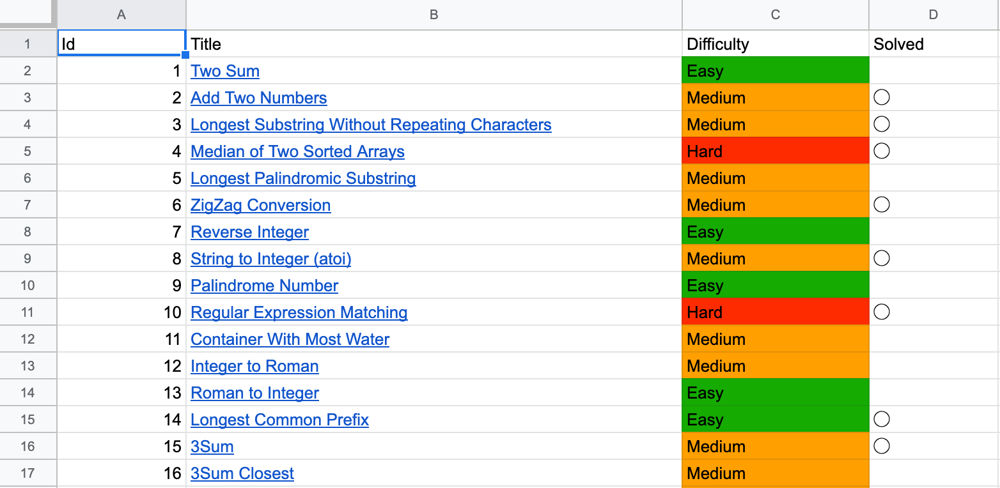

# leetcode-checksheet
LeetCode solving problems' checking sheet generator

## Usage
1. Get spreadsheet credentials from [Google APIs](https://console.developers.google.com/apis/credentials).
2. Scrape leetcode problems list and save it as "leetcode_probrems.json".
3. Run following command:
```sh
$ python gen.py -c <credentials_file> -i <spreadsheet_id> -p <problems_filename>
```

4. Open spreadsheet "leetcode_solving_problems"
